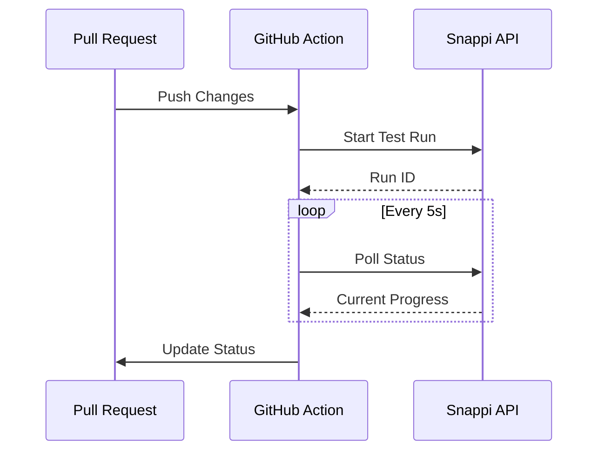

# GitHub Action Integration

The GitHub Action provides seamless CI/CD integration, managing the visual testing process and providing real-time
status updates.

## Implementation

```typescript
async function pollForResults(runId: string, maxWaitTime = 600000): Promise<TestResult[]> {
  const startTime = Date.now();

  while (Date.now() - startTime < maxWaitTime) {
    const status = await snappiClient.getRunStatus(runId);

    switch (status.state) {
      case 'COMPLETED':
        return status.results;
      case 'FAILED':
        throw new Error(`Run failed: ${status.error}`);
      case 'IN_PROGRESS':
        core.info(`Processed ${status.completedComparisons} of ${status.totalComparisons} comparisons...`);
        await new Promise(r => setTimeout(r, 5000));
        break;
    }
  }

  throw new Error('Timed out waiting for results');
}
```

## Usage in Workflows

```yaml
name: Visual Testing
on:
  pull_request:
    paths:
      - 'apps/storybook-demo/**'

jobs:
  visual-test:
    runs-on: ubuntu-latest
    container:
      image: mcr.microsoft.com/playwright:v1.46.0-jammy-browsers

    steps:
      - uses: actions/checkout@v4

      - name: Run Visual Tests
        uses: reshot/snappi-action@v1
        with:
          api-key: ${{ secrets.SNAPPI_API_KEY }}
          storybook-dir: 'apps/storybook-demo/storybook-static'
```

## Status Integration



## Configuration Options

| Option | Description | Default |
|--------|-------------|---------|
| `api-key` | Snappi API key | Required |
| `storybook-dir` | Storybook build directory | `storybook-static` |
| `threshold` | Diff threshold percentage | `0.1` |
| `max-retries` | Maximum retry attempts | `2` |