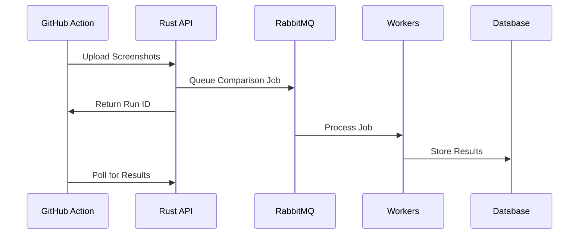

# Message Queue System

The RabbitMQ-based message queue system handles asynchronous processing of visual comparison jobs, enabling scalable and reliable test execution.

## Job Structure

```rust
#[derive(Serialize, Deserialize)]
struct ComparisonJob {
    run_id: String,
    images: Vec<ImageLocation>,
    metadata: RunMetadata,
    priority: JobPriority,
    created_at: DateTime<Utc>,
}

#[derive(Serialize, Deserialize)]
struct ImageLocation {
    scenario: String,
    viewport: String,
    test_image_url: String,
    baseline_image_url: Option<String>,
}
```

## Queue Flow

