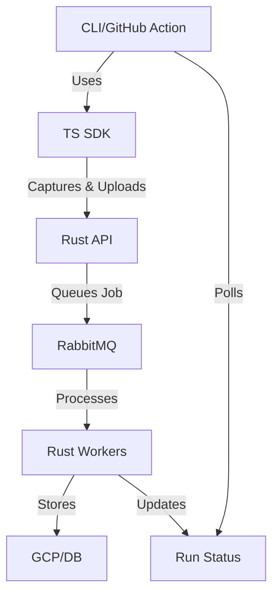
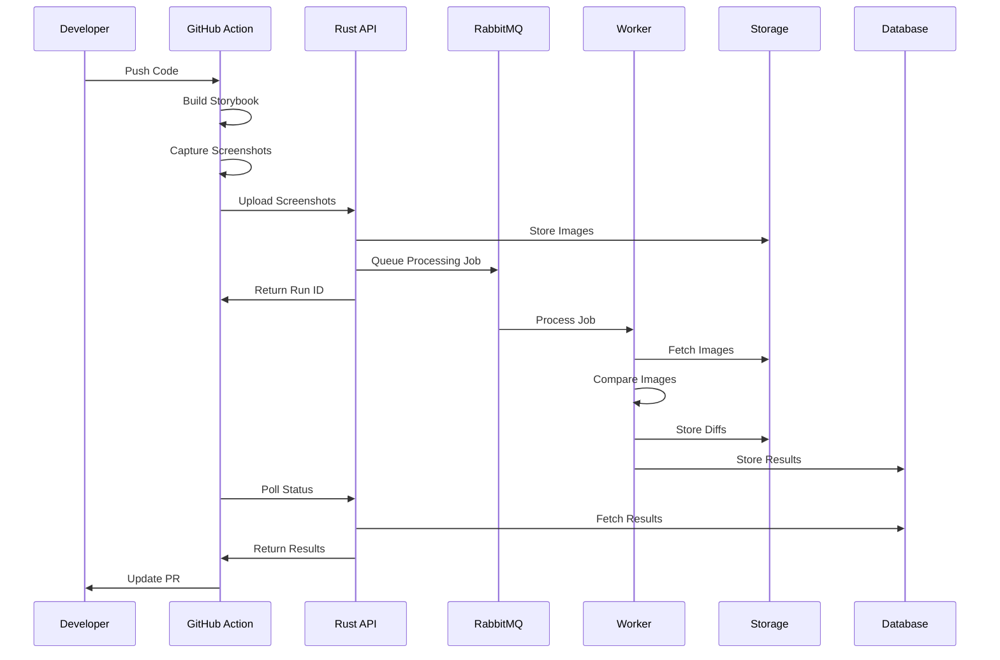

# Snappi Architecture Overview

Snappi is a visual regression testing system built with a distributed architecture. It combines TypeScript for browser
automation with a Rust backend for image processing and storage management.

## Core Components

| Component      | Description                                   | Technologies    |
|----------------|-----------------------------------------------|-----------------|
| TypeScript SDK | Thin layer for browser automation and capture | TS, Playwright  |
| Rust Backend   | Core processing engine and API server         | Rust, actix-web |
| Message Queue  | Async job processing and distribution         | RabbitMQ        |
| Storage        | Image and data persistence                    | GCP, PostgreSQL |

## System Architecture

