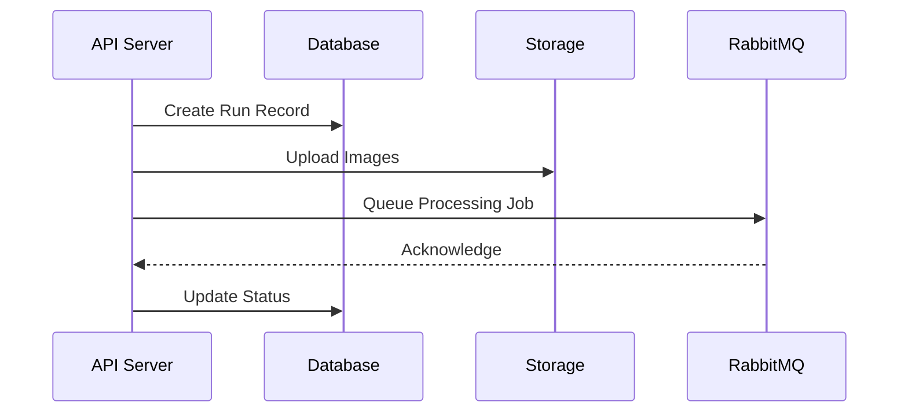

# Rust Backend

The Rust backend serves as the core processing engine for Snappi, handling image processing, storage management, and
test coordination.

## Core Components

```rust
pub struct VisualTestingService {
    storage: GcpStorage,
    db: Database,
    image_processor: ImageProcessor,
}

impl VisualTestingService {
    async fn create_run(&self, images: Vec<Image>) -> TestRun {
        // 1. Store uploaded images
        // 2. Fetch baseline images
        // 3. Process comparisons
        // 4. Store results
    }
}
```

## API Endpoints
Test Run Management
```http
POST /api/v1/runs - Create new test run
GET /api/v1/runs/{id} - Get run status
GET /api/v1/runs/{id}/results - Get run results
```

Image Management

```http
POST /api/v1/images - Upload images
GET /api/v1/images/{id} - Get image
GET /api/v1/images/{id}/diff - Get diff image
```


## Database Schema

```sql
CREATE TABLE runs
(
    id           UUID PRIMARY KEY,
    status       VARCHAR(50),
    created_at   TIMESTAMP,
    completed_at TIMESTAMP,
    metadata     JSONB
);

CREATE TABLE images
(
    id       UUID PRIMARY KEY,
    run_id   UUID REFERENCES runs (id),
    type     VARCHAR(50),
    url      TEXT,
    metadata JSONB
);
```

## Processing Flow

